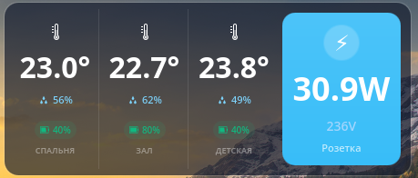

# Tuya Thermometers Widget for KDE Plasma 6

A modern desktop widget for KDE Plasma 6 that displays real-time data from Tuya smart home devices including thermometers and smart plugs.



## Features

- 🌡️ **Temperature & Humidity Monitoring** - Display data from up to 3 Tuya thermometer/hygrometer sensors
- 🔋 **Battery Status** - Color-coded battery indicators (green/orange/red) for battery-powered devices
- ⚡ **Smart Plug Monitoring** - Real-time power consumption, voltage, and daily energy usage
- 🎨 **Modern Card Design** - Clean, rounded card interface that matches KDE Plasma 6 theme
- 🔄 **Auto-refresh** - Updates every 30 seconds
- 🌍 **Multi-region Support** - Works with Tuya Cloud regions (EU, US, CN, IN, etc.)

## Requirements

- Debian 13 (or similar Linux distribution)
- KDE Plasma 6
- Python 3.11+
- Tuya Cloud Developer Account

## Installation

### 1. Get Tuya Cloud Credentials

1. Go to [Tuya IoT Platform](https://iot.tuya.com)
2. Create a Cloud Project:
   - **Cloud** → **Development** → **Create Cloud Project**
   - Select **Smart Home** industry
   - Choose your region (Europe, Americas, etc.)
3. Copy your credentials:
   - **Client ID** (Access ID)
   - **Client Secret** (Access Secret)
4. Subscribe to required APIs:
   - Go to **API** tab → Subscribe to:
     - IoT Core
     - Authorization
     - Smart Home Basic Service
     - Device Management
5. Link your Tuya app account:
   - **Devices** tab → **Link Tuya App Account**
   - Enter your SmartLife app email/phone
6. Get Device IDs from the **Devices** list

### 2. Install Widget

```bash
# Clone repository
git clone git@github.com:Charly3X/tuya_termometrs.git
cd tuya_termometrs

# Create configuration
cp config.json.example config.json
nano config.json  # Edit with your credentials

# Install
chmod +x install.sh
./install.sh
```

### 3. Add Widget to Desktop

1. Right-click on desktop → **Add Widgets**
2. Search for **"Tuya Thermometers"**
3. Drag widget to desktop or panel

## Configuration

Edit `config.json`:

```json
{
    "region": "eu",
    "client_id": "YOUR_CLIENT_ID",
    "client_secret": "YOUR_CLIENT_SECRET",
    "device_id": "ANY_DEVICE_ID",
    "devices": [
        "THERMOMETER_1_ID",
        "THERMOMETER_2_ID",
        "THERMOMETER_3_ID"
    ],
    "socket": "SMART_PLUG_ID"
}
```

**Parameters:**
- `region` - Tuya Cloud region: `eu`, `us`, `cn`, `in`, `ue`
- `client_id` - Your Tuya Client ID
- `client_secret` - Your Tuya Client Secret
- `device_id` - Any device ID (required for API initialization)
- `devices` - Array of 3 thermometer device IDs
- `socket` - Smart plug device ID (optional)

## Widget Display

### Thermometer Cards
Each card shows:
- 🌡️ Temperature in °C
- 💧 Humidity percentage
- 🔋 Battery level (color-coded)
- Device name

### Smart Plug Card
Shows:
- ⚡ Current power consumption (W)
- Voltage (V)
- Daily energy usage (kWh)
- Device name

## Troubleshooting

### No data from battery-powered sensors
Battery-powered Tuya sensors send data periodically (every 30-60 minutes) to save power. The widget uses Tuya's shadow properties API to fetch the last known values.

### "No devices found"
1. Ensure you've linked your SmartLife app account in Tuya IoT Platform
2. Check that you've added the correct Data Center in your project
3. Verify API subscriptions are active

### Widget not updating
```bash
# Check systemd timer status
systemctl --user status tuya-update.timer

# Restart timer
systemctl --user restart tuya-update.timer

# Check logs
journalctl --user -u tuya-update.service
```

## Development

### Project Structure
```
tuya_termometrs/
├── contents/
│   ├── config/
│   │   └── main.xml
│   └── ui/
│       └── main.qml
├── metadata.json
├── tuya_client.py
├── install.sh
├── config.json.example
└── README.md
```

### Manual Testing
```bash
# Test data fetching
./venv/bin/python3 tuya_client.py

# List all devices
./venv/bin/python3 list_devices.py

# Test region detection
./venv/bin/python3 test_region.py
```

## Uninstall

```bash
# Stop and disable timer
systemctl --user stop tuya-update.timer
systemctl --user disable tuya-update.timer

# Remove widget
rm -rf ~/.local/share/plasma/plasmoids/org.kde.plasma.tuya
rm ~/.config/systemd/user/tuya-update.*

# Restart Plasma
killall plasmashell && kstart plasmashell &
```

## License

MIT License - feel free to modify and distribute

## Credits

Built with:
- [tinytuya](https://github.com/jasonacox/tinytuya) - Python library for Tuya Cloud API
- KDE Plasma 6 - Desktop environment
- Tuya IoT Platform - Smart home device cloud

## Contributing

Issues and pull requests are welcome!

## Author

Created for monitoring Tuya smart home devices on KDE Plasma 6 desktop.
