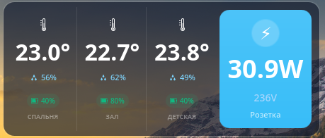

# Tuya Thermometers Widget for KDE Plasma 6

A modern desktop widget for KDE Plasma 6 that displays real-time data from Tuya smart home devices including thermometers and smart plugs.



## Features

- 🌡️ **Temperature & Humidity Monitoring** - Display data from up to 3 Tuya thermometer/hygrometer sensors
- 🔋 **Battery Status** - Color-coded battery indicators (green/orange/red) for battery-powered devices
- ⚡ **Smart Plug Monitoring** - Real-time power consumption, voltage, and daily energy usage
- 🎨 **Modern Card Design** - Clean, rounded card interface with gradient background and glass effect
- 🔄 **Configurable Update Intervals** - Separate refresh rates for thermometers and smart plug
- 🕐 **Last Update Timestamps** - Shows when each device type was last updated
- 🌍 **Multi-region Support** - Works with Tuya Cloud regions (EU, US, CN, IN, etc.)
- ⚡ **Optimized API Calls** - Batch requests and device name caching for faster updates

## Requirements

- Debian 13 (or similar Linux distribution)
- KDE Plasma 6
- Python 3.11+
- Tuya Cloud Developer Account

## Installation

### 1. Get Tuya Cloud Credentials

1. Go to [Tuya IoT Platform](https://iot.tuya.com)
2. Create a Cloud Project:
   - **Cloud** → **Development** → **Create Cloud Project**
   - Select **Smart Home** industry
   - Choose your region (Europe, Americas, etc.)
3. Copy your credentials:
   - **Client ID** (Access ID)
   - **Client Secret** (Access Secret)
4. Subscribe to required APIs:
   - Go to **API** tab → Subscribe to:
     - IoT Core
     - Authorization
     - Smart Home Basic Service
     - Device Management
5. Link your Tuya app account:
   - **Devices** tab → **Link Tuya App Account**
   - Enter your SmartLife app email/phone
6. Get Device IDs from the **Devices** list

### 2. Install Widget

```bash
# Clone repository
git clone git@github.com:Charly3X/tuya_termometrs.git
cd tuya_termometrs

# Create configuration
cp config.json.example config.json
nano config.json  # Edit with your credentials

# Install
chmod +x install.sh
./install.sh
```

### 3. Add Widget to Desktop

1. Right-click on desktop → **Add Widgets**
2. Search for **"Tuya Thermometers"**
3. Drag widget to desktop or panel

## Configuration

### Cloud API Mode (Default)

Edit `config.json`:

```json
{
    "region": "eu",
    "client_id": "YOUR_CLIENT_ID",
    "client_secret": "YOUR_CLIENT_SECRET",
    "device_id": "YOUR_DEVICE_ID",
    "devices": [
        "DEVICE_ID_1",
        "DEVICE_ID_2",
        "DEVICE_ID_3"
    ],
    "socket": "SMART_PLUG_ID"
}
```

**Parameters:**
- `region` - Tuya Cloud region: `eu`, `us`, `cn`, `in`, `ue`
- `client_id` - Your Tuya Client ID
- `client_secret` - Your Tuya Client Secret
- `device_id` - Any valid device ID from your account (required for API initialization)
- `devices` - Array of 3 thermometer device IDs
- `socket` - Smart plug device ID (optional, omit if not using)

### Local Network Mode

For faster response and offline operation, you can connect directly to devices on your local network.

**Step 1: Get Local Keys**

```bash
./venv/bin/python3 get_local_keys.py
```

This will display all your devices with their local keys and IPs.

**Step 2: Add Local Configuration**

Add `local_devices` and `local_socket` sections to `config.json`:

```json
{
    "region": "eu",
    "client_id": "YOUR_CLIENT_ID",
    "client_secret": "YOUR_CLIENT_SECRET",
    "device_id": "YOUR_DEVICE_ID",
    "devices": ["DEVICE_ID_1", "DEVICE_ID_2", "DEVICE_ID_3"],
    "local_devices": [
        {
            "id": "DEVICE_ID_1",
            "name": "Living Room",
            "ip": "192.168.1.100",
            "local_key": "LOCAL_KEY_FROM_SCRIPT",
            "version": "3.3"
        },
        {
            "id": "DEVICE_ID_2",
            "name": "Bedroom",
            "ip": "192.168.1.101",
            "local_key": "LOCAL_KEY_FROM_SCRIPT",
            "version": "3.3"
        },
        {
            "id": "DEVICE_ID_3",
            "name": "Kitchen",
            "ip": "192.168.1.102",
            "local_key": "LOCAL_KEY_FROM_SCRIPT",
            "version": "3.3"
        }
    ],
    "local_socket": {
        "id": "SOCKET_DEVICE_ID",
        "name": "Smart Plug",
        "ip": "192.168.1.103",
        "local_key": "SOCKET_LOCAL_KEY",
        "version": "3.3"
    }
}
```

**Step 3: Switch to Local Mode**

Right-click widget → **Configure** → **Connection mode** → Select **"Local Network"**

**Local Mode Benefits:**
- ⚡ Faster response (no cloud roundtrip)
- 🔒 Works without internet connection
- 📉 Reduced API calls and rate limits
- 🏠 All data stays on local network

**Performance Features:**
- Device names are cached for 24 hours to reduce API calls (Cloud mode)
- Separate update intervals for thermometers and smart plug
- Batch API requests fetch all device statuses in a single call (Cloud mode)
- Direct local communication for instant updates (Local mode)
- Fallback to shadow properties API for battery-powered devices (Cloud mode)

## Widget Configuration

Right-click on widget → **Configure** to adjust:

- **Connection Mode** - Choose between Cloud API or Local Network
- **Thermometer Update Interval** - How often to refresh thermometer data (30-600 seconds, default: 120s)
- **Socket Update Interval** - How often to refresh smart plug data (10-300 seconds, default: 30s)
- **Background Opacity** - Adjust widget transparency (0.0-1.0)
- **Enable Logging** - Turn on detailed logging for troubleshooting

Each section displays its last update time at the bottom.

## Widget Display

### Thermometer Cards
Each card shows:
- 🌡️ Temperature in °C
- 💧 Humidity percentage
- 🔋 Battery level (color-coded)
- Device name
- Last update time (displayed under middle thermometer)

### Smart Plug Card
Shows:
- ⚡ Current power consumption (W)
- Voltage (V)
- Daily energy usage (kWh)
- Device name
- Last update time

## Troubleshooting

### No data from battery-powered sensors
Battery-powered Tuya sensors send data periodically (every 30-60 minutes) to save power. The widget uses:
1. Batch status API for real-time data (when available)
2. Shadow properties API as fallback for last known values

### "No devices found"
1. Ensure you've linked your SmartLife app account in Tuya IoT Platform
2. Check that you've added the correct Data Center in your project
3. Verify API subscriptions are active

### Widget not updating
Check widget configuration settings (right-click → Configure) and adjust update intervals if needed. The widget uses internal QML timers - no systemd services required.

### Device names not showing
Device names are cached for 24 hours. To force refresh:
```bash
rm ~/projects/tuya/device_names_cache.json
```

## Development

### Project Structure
```
tuya_termometrs/
├── contents/
│   ├── config/
│   │   └── main.xml
│   └── ui/
│       └── main.qml
├── metadata.json
├── tuya_client.py
├── install.sh
├── config.json.example
└── README.md
```

### Manual Testing
```bash
# Test data fetching (all devices) - Cloud mode
./venv/bin/python3 tuya_client.py

# Test thermometers only - Cloud mode
./venv/bin/python3 tuya_client.py thermometers

# Test socket only - Cloud mode
./venv/bin/python3 tuya_client.py socket

# Test with local network mode
./venv/bin/python3 tuya_client.py thermometers local
./venv/bin/python3 tuya_client.py socket local
./venv/bin/python3 tuya_client.py all local

# Get local keys for devices
./venv/bin/python3 get_local_keys.py

# List all devices
./venv/bin/python3 list_devices.py

# Test region detection
./venv/bin/python3 test_region.py
```

## Uninstall

```bash
# Remove widget
rm -rf ~/.local/share/plasma/plasmoids/org.kde.plasma.tuya

# Restart Plasma
killall plasmashell && kstart plasmashell &
```

## License

MIT License - feel free to modify and distribute

## Credits

Built with:
- [tinytuya](https://github.com/jasonacox/tinytuya) - Python library for Tuya Cloud API
- KDE Plasma 6 - Desktop environment
- Tuya IoT Platform - Smart home device cloud

## Contributing

Issues and pull requests are welcome!

## Author

Created for monitoring Tuya smart home devices on KDE Plasma 6 desktop.
